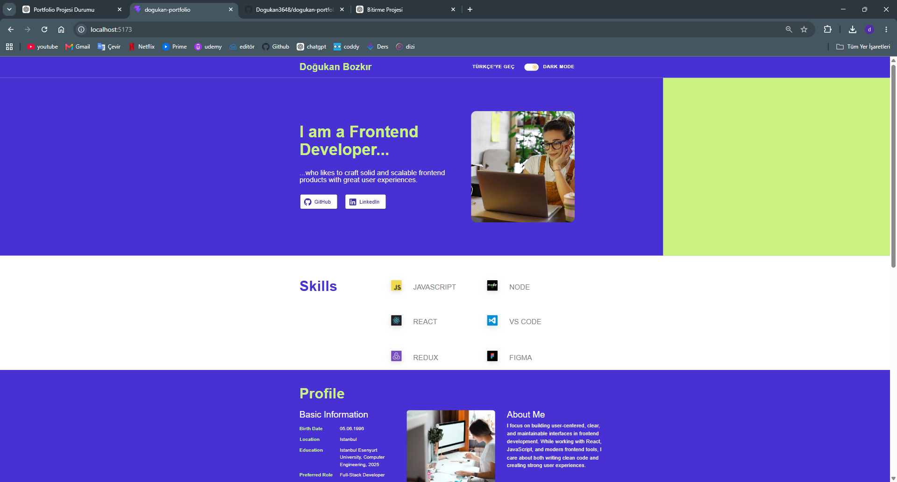
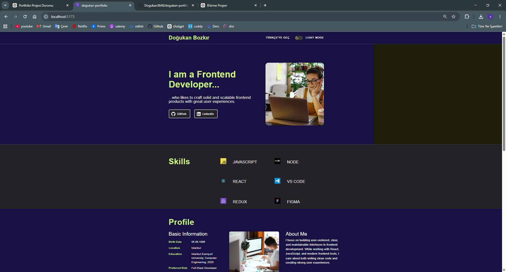
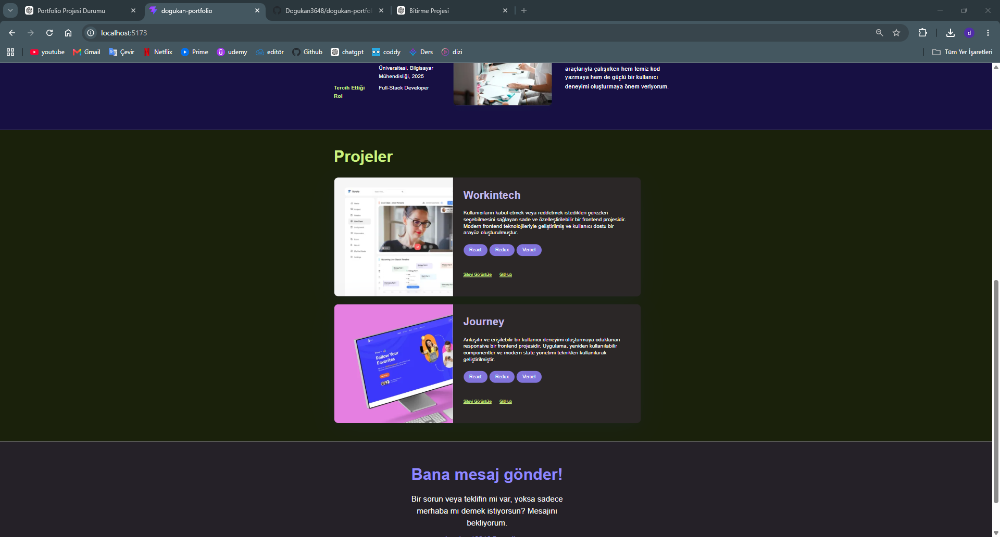

# 🚀 Doğukan Portfolio

A modern, responsive, and multilingual personal portfolio website built with **React** and **Vite**.

This project was developed to showcase my frontend development skills while focusing on clean architecture, reusable components, scalable state management, responsive design, accessibility, and maintainable code.

The application supports **Light/Dark Theme**, **English & Turkish language switching**, **persistent user preferences**, and demonstrates **API communication** by sending portfolio data to an external service using **Axios**.

---

# 📸 Screenshots

### 💻 Desktop — Light Theme



### 🌙 Desktop — Dark Theme



### 🇹🇷 Desktop — Turkish Dark Theme



---

# ✨ Features

- 🌗 Light / Dark Theme
- 🌍 English & Turkish Language Support
- 💾 Persistent Theme & Language Preferences using Local Storage
- ⚛️ Global State Management with Context API + useReducer
- 🎨 Pixel-perfect implementation based on the provided Figma design
- 📱 Fully Responsive Design
- 🔄 Portfolio Data Submission using Axios
- ⚡ Fast Development Environment powered by Vite
- 🧪 Unit Testing with Vitest & React Testing Library
- 📏 ESLint Integration for Code Quality
- 🖼️ Optimized Images using WebP
- ♿ Semantic HTML & Accessibility Improvements

---

# 🛠️ Tech Stack

| Category         | Technologies                  |
| ---------------- | ----------------------------- |
| Frontend         | React 19                      |
| Build Tool       | Vite                          |
| Styling          | Tailwind CSS                  |
| State Management | Context API + useReducer      |
| HTTP Client      | Axios                         |
| Testing          | Vitest, React Testing Library |
| Code Quality     | ESLint                        |
| Icons            | React Icons                   |

---

# 📂 Project Structure

```text
src
│
├── assets
│   ├── icons
│   └── images
│
├── components
│
├── context
│   ├── actions.js
│   ├── AppContext.js
│   ├── AppProvider.jsx
│   ├── appReducer.js
│   └── appStorage.js
│
├── data
│   └── portfolioData.js
│
├── hooks
│   └── useApp.js
│
├── services
│   └── portfolioApi.js
│
├── test
│   └── App.test.jsx
│
├── App.jsx
└── main.jsx
```

---

# 🏗️ Architecture

The project follows a layered architecture designed to improve maintainability, readability, and scalability.

### Context API

Provides the global application state.

### useReducer

Handles all application state transitions through centralized reducer logic.

### Actions

Keeps action types centralized and reusable.

### Reducer

Contains all state update logic in a predictable and maintainable way.

### Service Layer

Isolates all API communication from UI components.

### Data Layer

Stores multilingual portfolio content in a centralized structure.

### Custom Hooks

Simplifies Context consumption across the application.

---

# 🌍 Internationalization

The application currently supports two languages:

- 🇬🇧 English
- 🇹🇷 Turkish

All translations are managed from a centralized `portfolioData.js` file, making future language additions straightforward.

---

# 🌗 Theme Persistence

The selected theme is automatically saved to **Local Storage**.

When users revisit the application, their preferred theme is restored automatically.

---

# 💾 Local Storage

The application persists the following user preferences:

- Theme
- Language

State initialization is handled using the lazy initialization feature of **useReducer**.

---

# 🌐 API Integration

The application demonstrates communication with an external API by submitting portfolio data using **Axios**.

Implemented features include:

- Loading State
- Error Handling
- Service Layer Architecture
- Environment Variable Configuration

---

# 🔐 Environment Variables

Create a `.env.local` file in the project root.

```env
VITE_API_URL=https://reqres.in/api/workintech
VITE_REQRES_API_KEY=your_api_key
```

An example configuration is provided in the `.env.example` file.

---

# 🚀 Installation

Clone the repository

```bash
git clone https://github.com/Dogukan3648/dogukan-portfolio.git
```

Navigate to the project directory

```bash
cd dogukan-portfolio
```

Install dependencies

```bash
npm install
```

Start the development server

```bash
npm run dev
```

---

# 📜 Available Scripts

### Development

```bash
npm run dev
```

### Production Build

```bash
npm run build
```

### Run Tests

```bash
npm run test:run
```

### Run ESLint

```bash
npm run lint
```

---

# ✅ Testing

The project includes automated tests covering:

- Application Rendering
- Language Switching
- Dark Mode
- Local Storage Initialization
- Local Storage Persistence
- API Communication
- API Failure Fallback

Current Status

```
✅ 7 / 7 Tests Passing
```

---

# ⚡ Performance Optimizations

- WebP image optimization
- Responsive image sizing
- Lazy reducer initialization
- Environment variable configuration
- Service layer abstraction
- Optimized asset loading

---

# ♿ Accessibility

Accessibility improvements include:

- Semantic HTML
- ARIA Labels
- Accessible Theme Switch
- Keyboard-friendly Navigation
- Responsive Typography

---

# 🔮 Future Improvements

Potential future enhancements:

- Contact Form Integration
- Email Service Integration
- Project Filtering
- Blog Section
- CMS Integration
- Animations
- Additional Language Support

---

# 👨‍💻 Author

**Doğukan Bozkır**

- GitHub: [Dogukan3648](https://github.com/Dogukan3648)
- LinkedIn: [Doğukan Bozkır](https://www.linkedin.com/in/dogukanbozkir/)

---

# 📄 License

This project was developed for educational purposes and as a personal portfolio project.
