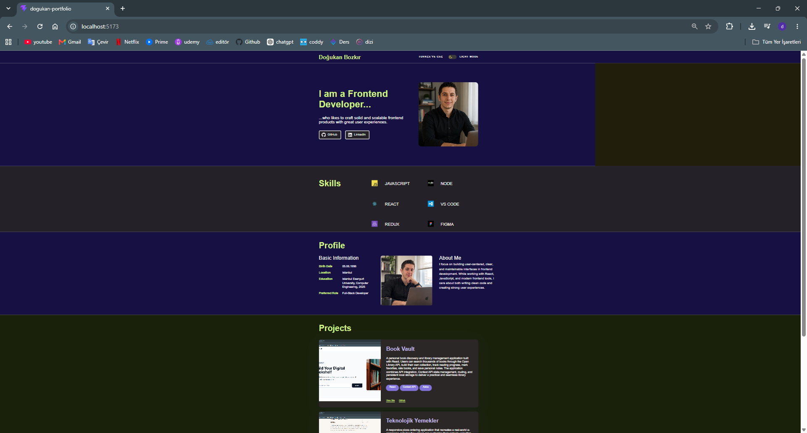
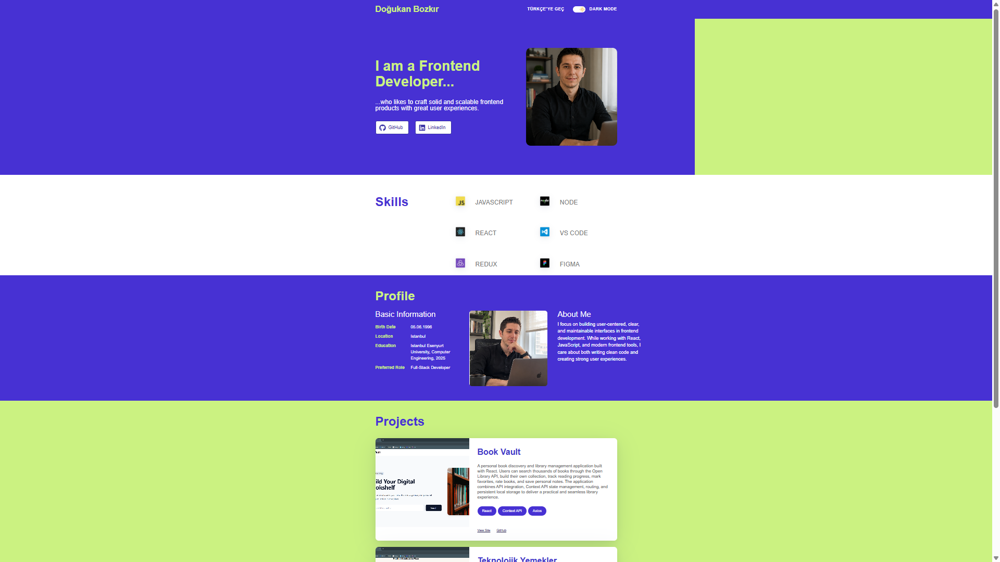
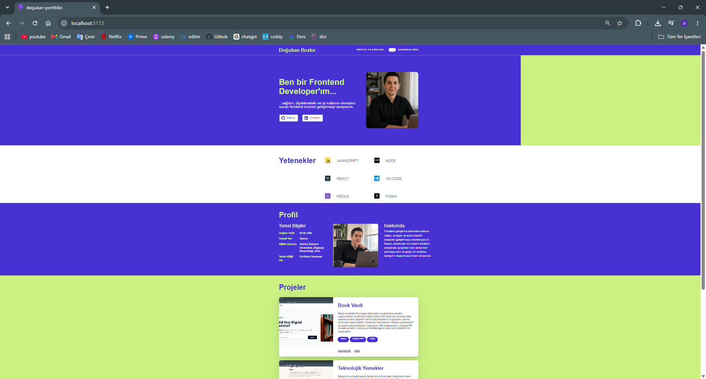

# 🚀 Doğukan Portfolio

A modern, responsive, and multilingual personal portfolio website built with **React** and **Vite**.

This project was developed to showcase my frontend development skills with a focus on clean architecture, reusable components, predictable state management, responsive design, accessibility, and maintainable code.

The application supports **Light/Dark Theme**, **English & Turkish language switching**, **persistent user preferences**, and demonstrates **API communication** by submitting portfolio data to an external service using **Axios**.

---

# 📸 Screenshots

## 🌙 Dark Theme

### English



### Turkish


## ☀️ Light Theme

### English



### Turkish



---

# ✨ Features

- 🌗 Light / Dark Theme
- 🌍 English & Turkish Language Support
- 💾 Persistent Theme & Language Preferences using Local Storage
- ⚛️ Global State Management with Context API + useReducer
- 🎨 Implementation based on the provided Figma design
- 📱 Fully Responsive Design
- 🔄 Portfolio Data Submission using Axios
- ⚡ Fast Development Environment powered by Vite
- 🧪 Automated Testing with Vitest & React Testing Library
- 📏 ESLint Integration for Code Quality
- 🖼️ Optimized Images using WebP
- ♿ Semantic HTML & Accessibility Improvements
- 🧩 Reusable Component Architecture
- 🔐 Environment Variable Configuration

---

# 🛠️ Tech Stack

| Category         | Technologies                  |
| ---------------- | ----------------------------- |
| Frontend         | React 19                      |
| Build Tool       | Vite                          |
| Styling          | Tailwind CSS                  |
| State Management | Context API + useReducer      |
| HTTP Client      | Axios                         |
| Testing          | Vitest, React Testing Library |
| Code Quality     | ESLint                        |
| Icons            | React Icons                   |

---

# 📂 Project Structure

```text
src
│
├── assets
│   ├── icons
│   └── images
│
├── components
│
├── context
│   ├── actions.js
│   ├── AppContext.js
│   ├── AppProvider.jsx
│   ├── appReducer.js
│   └── appStorage.js
│
├── data
│   └── portfolioData.js
│
├── hooks
│   └── useApp.js
│
├── sections
│   ├── Footer.jsx
│   ├── Header.jsx
│   ├── Hero.jsx
│   ├── Profile.jsx
│   ├── Projects.jsx
│   └── Skills.jsx
│
├── services
│   └── portfolioApi.js
│
├── test
│   └── App.test.jsx
│
├── App.jsx
└── main.jsx
```

---

# 🏗️ Architecture

The project uses a structured frontend architecture designed to keep application logic organized, predictable, and maintainable.

### Context API

Provides shared application state to components without unnecessary prop drilling.

### useReducer

Manages application state transitions through centralized reducer logic.

### Actions

Keeps action types centralized and reusable across the application.

### Reducer

Handles state updates in a predictable and maintainable way.

### Service Layer

Separates API communication from UI components and application state logic.

### Data Layer

Stores portfolio content for both supported languages in a centralized structure.

### Custom Hooks

Provides a simplified interface for consuming application context across components.

### Section-Based Components

The interface is divided into independent sections such as Hero, Skills, Profile, Projects, and Footer to improve readability and maintainability.

---

# 🌍 Multilingual Support

The application currently supports two languages:

- 🇬🇧 English
- 🇹🇷 Turkish

Language content is managed through a centralized `portfolioData.js` structure.

The active language is controlled through the application's global state, allowing the interface content to change dynamically without requiring an external internationalization library.

The selected language is also persisted in Local Storage.

---

# 🌗 Theme Management

The application supports both **Light** and **Dark** themes.

Theme state is managed globally using **Context API + useReducer**.

The selected theme is automatically saved to **Local Storage**, allowing the user's preference to be restored when the application is reopened.

---

# 💾 Local Storage

The application persists the following user preferences:

- Theme
- Language

State initialization uses the lazy initialization capability of **useReducer**, allowing stored preferences to be restored when the application starts.

---

# 🌐 API Integration

The application demonstrates external API communication by submitting portfolio data using **Axios**.

API-related logic is separated from the UI through a dedicated service layer.

Implemented features include:

- Portfolio Data Submission
- Loading State
- Error Handling
- Service Layer Architecture
- Environment Variable Configuration
- Graceful fallback when the API request fails

---

# 🔐 Environment Variables

Create a `.env.local` file in the project root.

```env
VITE_API_URL=https://reqres.in/api/workintech
VITE_REQRES_API_KEY=your_api_key
```

An example configuration is provided in the `.env.example` file.

> The actual API key should never be committed to the repository.

---

# 🚀 Installation

Clone the repository:

```bash
git clone https://github.com/Dogukan3648/dogukan-portfolio.git
```

Navigate to the project directory:

```bash
cd dogukan-portfolio
```

Install dependencies:

```bash
npm install
```

Start the development server:

```bash
npm run dev
```

---

# 📜 Available Scripts

### Development

```bash
npm run dev
```

### Production Build

```bash
npm run build
```

### Run Tests

```bash
npm run test:run
```

### Run ESLint

```bash
npm run lint
```

---

# ✅ Testing

The project includes automated tests covering key application behavior:

- Application Rendering
- Language Switching
- Dark Mode
- Local Storage Initialization
- Local Storage Persistence
- API Communication
- API Failure Fallback

Current test status:

```text
✅ 7 / 7 Tests Passing
```

---

# ⚡ Performance Optimizations

The project includes several optimizations aimed at improving loading performance and maintainability:

- WebP image optimization
- Responsive image sizing
- Lazy reducer initialization
- Environment variable configuration
- Service layer abstraction
- Optimized asset loading
- Production build optimization with Vite

---

# ♿ Accessibility

Accessibility considerations include:

- Semantic HTML
- ARIA Labels
- Accessible Theme Switch
- Keyboard-friendly Navigation
- Descriptive Image Alternative Text
- Responsive Typography

---

# 🔮 Future Improvements

Potential future enhancements include:

- Contact Form Integration
- Email Service Integration
- Project Filtering
- Blog Section
- CMS Integration
- UI Animations
- Additional Language Support

---

# 👨‍💻 Author

**Doğukan Bozkır**

- GitHub: https://github.com/Dogukan3648
- LinkedIn: https://www.linkedin.com/in/dogukanbozkir/

---

# 📄 License

This project was developed for educational purposes and as a personal portfolio project.
